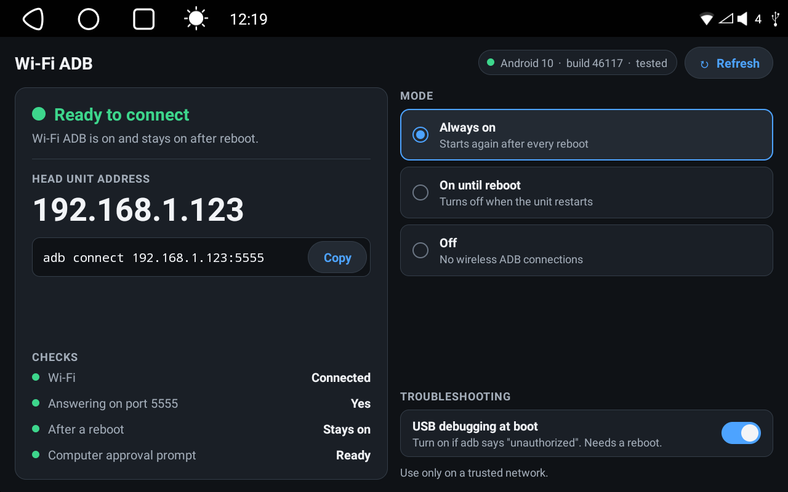

# ATOTO S8G1104MS Wi-Fi ADB

[](https://github.com/atoqe/atoto-s8g1104ms-wifi-adb/actions/workflows/android.yml)
[](LICENSE)

> [!TIP]
> ### 🚀 [Quick Start guide →](QUICKSTART.md)
> Step-by-step from a stock head unit to an `adb shell` over Wi-Fi in about ten minutes.

A small bootstrap app that turns on Android Debug Bridge (ADB) over Wi-Fi on an
ATOTO **S8G1104MS** head unit. It asks the FYT vendor service that already
ships in the firmware to open port 5555; it needs **no root, no Magisk, no
patched boot image, and no working USB ADB**.

This is a fork of [lrehmann/atoto-adb-via-wifi](https://github.com/lrehmann/atoto-adb-via-wifi),
which found the method on an S8G2A74MS. This fork fixes the disable action,
verifies every request on the unit, and is checked against the S8G1104MS
firmware. All credit for the original technique goes to lrehmann.

> [!WARNING]
> Experimental, vendor-specific software. Not an official ATOTO tool. It uses
> an undocumented FYT binder interface that a firmware update can change or
> remove. ADB gives a paired computer full control of the head unit: read
> [SECURITY.md](SECURITY.md) first.

## Tested on

| Model | Android | Firmware | Result |
| --- | --- | --- | --- |
| S8G1104MS | 10 (API 29) | incremental `46117`, `com.syu.ms` 25.1119 (APP20251124 / System20251117) | Works (this fork, through 1.3.0) |
| S8G2A74MS | 10 | `QP1A.190711.020`, incremental `33515` | Works (upstream 1.0.0) |

Other S8 models and FYT units may work: the app checks each step and tells you
exactly what did not apply. Please report results (see [Compatibility reports](#compatibility-reports)).

## Quick start

1. Download **`atoto-s8g1104ms-wifi-adb.apk`** from the
   [latest release](https://github.com/atoqe/atoto-s8g1104ms-wifi-adb/releases/latest).
2. Install it on the head unit from a USB stick (file manager) or the head-unit
   browser. No ADB connection is needed for this.
3. Connect the head unit and your computer to the same trusted Wi-Fi network.
4. Open **S8 Wi-Fi ADB (1104MS)**. It shows the unit's IP address, or
   **Not connected to Wi-Fi**.
5. Under **MODE**, tap **Always on**, read the trusted Wi-Fi warning, and tap
   **Turn on**. Wait for **Ready to connect**.
6. On the computer:

   ```sh
   adb connect HEAD_UNIT_IP:5555
   adb devices -l
   ```

7. Approve the RSA prompt on the head unit. `adb devices` should now say
   `device`.

Prefer not to run `adb` yourself? An AI coding agent such as Claude Code can
install it and connect for you: see
[Let Claude Code connect](QUICKSTART.md#let-claude-code-connect).

Each step in more detail, with what the app shows: [QUICKSTART.md](QUICKSTART.md).
Troubleshooting and the full guide: [docs/INSTALL.md](docs/INSTALL.md).

## What the app does



- Binds to `com.syu.ms/app.ToolkitService` and uses FYT main-module command 161
  to set the ADB port properties, then restarts `adbd`.
- One screen, two columns: live status on the left, controls on the right.
  Three modes: **Always on** (survives reboots), **On until reboot**, and
  **Off**.
- After every request it reads the properties back and probes
  `127.0.0.1:5555`, then says either that it worked or exactly what did not
  change.
- Shows the head unit's Wi-Fi IP address in large type (or that it is not
  connected to Wi-Fi), whether `adbd` is answering, whether it stays on after
  reboot, and whether USB debugging (`adb_enabled`) is on. The screen updates
  by itself when Wi-Fi or ADB changes.
- Asks you to confirm you are on a trusted Wi-Fi network before turning
  Wi-Fi ADB on, and to confirm before turning it off.
- **USB debugging at boot**: a fallback for units where the Developer options
  toggle will not stay on. Without USB debugging, Android never shows the RSA
  prompt and `adb` stays `unauthorized`.
- Copies the `adb connect` command to the clipboard.

No background service (it only checks status while it is on screen), no network
requests (the only socket is the loopback probe), no analytics. Permissions:
`ACCESS_NETWORK_STATE` and `ACCESS_WIFI_STATE` to show the address and Wi-Fi
state, `INTERNET` for the loopback probe. The APK contains no firmware, vendor code, keys, or
addresses.

## Changes from upstream 1.0.0

- **Disable fix.** FYT command 161 silently ignores empty values, so 1.0.0's
  disable left `persist.adb.tcp.port=5555` in place and ADB came back after
  the next reboot. This fork clears it with `-1`.
- **Verified results** instead of "request sent" (adds the `INTERNET`
  permission, used only for the loopback probe).
- **USB debugging status** and the **USB debugging at boot** fallback
  (`persist.sys.usb.config=adb`, or back to `none`).
- Builds with current Android Studio: AGP 9.4.1, Gradle 9.8.0, compileSdk 37.
- Own package name `com.atoqe.atoto.wifiadb` and a release signing key (from
  1.2.0), so it installs alongside upstream instead of clashing with it.
- Targets Android 10 (API 29), the head unit's version, from 1.2.1. Google
  Play Protect blocks installing apps that target older versions.
- Redesigned single-screen interface from 1.3.0: two columns, dark theme,
  large type, mode picker, coloured status checks, the Wi-Fi IP address (or
  that the unit is not on Wi-Fi), and a trusted Wi-Fi warning before turning
  it on. **On until reboot** now also clears the persistent port, so it means
  the same thing whatever the previous mode was.
- App label `S8 Wi-Fi ADB (1104MS)`, version `1.3.0-s8g1104ms`.

Release 1.1.0 of this fork still used upstream's package name and a debug key.
1.2.0 and later install as a separate app and update each other in place
(1.3.0 installs over 1.2.x and keeps the current setting).

Release APKs from 1.2.0 on are signed with this certificate
(`CN=atoto-s8g1104ms-wifi-adb`). Check a download with
`apksigner verify --print-certs atoto-s8g1104ms-wifi-adb.apk`:

```text
SHA-256: 1b:a9:73:e4:72:27:fa:85:74:36:ad:0b:b6:bf:19:1b:8d:6c:7b:a1:86:67:0d:7c:8d:de:2c:74:c3:df:f6:98
```

## Build from source

Requirements: JDK 17 or newer (Android Studio's bundled JDK works) and the
Android SDK with platform 37.

```sh
git clone https://github.com/atoqe/atoto-s8g1104ms-wifi-adb.git
cd atoto-s8g1104ms-wifi-adb
./gradlew testDebugUnitTest lintDebug assembleDebug
```

The APK is written to
`app/build/outputs/apk/debug/atoto-s8g1104ms-wifi-adb-debug.apk`. Debug builds
use the package `com.atoqe.atoto.wifiadb.debug`, so they install beside the
release app instead of clashing with its signing key. On macOS
without a system JDK:

```sh
JAVA_HOME="/Applications/Android Studio.app/Contents/jbr/Contents/Home" ./gradlew assembleDebug
```

Release signing reads `ATOTO_SIGNING_STORE`, `ATOTO_SIGNING_STORE_PASSWORD`,
`ATOTO_SIGNING_KEY_ALIAS` and `ATOTO_SIGNING_KEY_PASSWORD` from the
environment; no keystore is committed. With those set, `./gradlew
assembleRelease` writes a signed
`app/build/outputs/apk/release/atoto-s8g1104ms-wifi-adb-release.apk`.

Releases are built by CI: pushing a `v*` tag runs the `release` job in
[.github/workflows/android.yml](.github/workflows/android.yml), which signs the
APK with the repository's `RELEASE_KEYSTORE_BASE64`,
`RELEASE_KEYSTORE_PASSWORD`, `RELEASE_KEY_ALIAS` and `RELEASE_KEY_PASSWORD`
secrets and attaches it to that tag's GitHub release (creating a draft
release if none exists). Builds from forks or without the secrets fail
rather than ship an unsigned APK.

## Compatibility reports

Open an issue with the Android version and build number shown at the top of
the app, plus the message shown after you chose a mode.
Do not post serial numbers, Wi-Fi names, or passwords.

## Documentation

- [Quick start](QUICKSTART.md)
- [Install and troubleshooting guide](docs/INSTALL.md)
- [Technical notes on the FYT interface](docs/TECHNICAL_NOTES.md)
- [Security notes](SECURITY.md)
- [Android Debug Bridge documentation](https://developer.android.com/tools/adb)

## Provenance

The original technique and app are lrehmann's; their README describes that
work as hands-on trial and error on an S8, developed with help from OpenAI
GPT-5.5 and GPT-5.6. This fork's S8G1104MS changes were made with Claude
(Anthropic) and checked against the S8G1104MS firmware's `com.syu.ms`. The FYT
binder interface is observed behaviour, not a documented API: review the
source and keep a recovery path.

## License and affiliation

MIT, the same license as the original project; see [LICENSE](LICENSE). Not
affiliated with or endorsed by ATOTO, FYT, Google, OpenAI, or Anthropic.
Product and company names belong to their respective owners.
